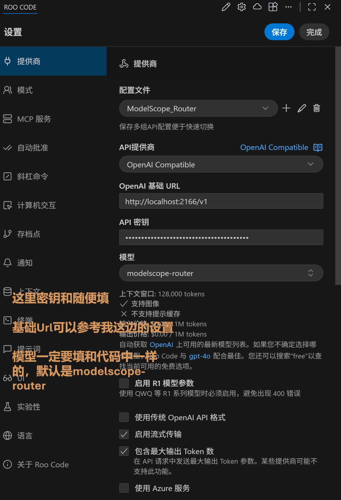

Inspired by [https://github.com/RuleViz/ModelScopeApiRouter](https://github.com/RuleViz/ModelScopeApiRouter)

# ModelScope 智能模型路由器 (ModelScope Smart Router)

<div align="center">


<br>


**用于 ModelScope 服务的企业级负载均衡与高可用路由网关**
</div>

---

## 📖 项目简介

ModelScope Smart Router 是一个基于 FastAPI 构建的高性能 AI 模型网关。它就像一个智能交通指挥官，旨在解决**单点故障**和**API调用限流**问题。通过智能路由算法，它能自动管理多个 ModelScope 模型实例，实现负载均衡、故障转移（Failover）和精细化的限流控制，确保您的 AI 应用始终保持高可用性。

无论您是个人开发者还是企业用户，都可以通过本系统统一管理 API 访问，提升服务的稳定性和成功率。完全兼容 OpenAI API 格式，可直接接入现有的 AI 工具链（如 Cursor, NextChat, LangChain 等）。

## ✨ 核心功能

- **🤖 智能路由策略**: 自动识别请求模型，在多个同类模型后端中选择最佳候选者。
- **⚖️ 负载均衡**: 基于调用次数和权重的负载均衡，防止单一账号或模型过载。
- **🛡️ 自动故障转移**: 当某个模型调用失败或超时，自动无缝切换到备用模型，用户无感知。
- **🚦 智能限流熔断**: 实时监测 API 调用限制，自动跳过已耗尽配额的模型，并在配额重置后自动恢复。
- **📊 可视化监控台**: 提供基于终端的 Rich UI 仪表盘，实时展示 QPS、成功率、响应时间及各模型健康状态。
- **🔌 OpenAI 兼容**: 提供与 OpenAI `v1/chat/completions` 完全兼容的接口，零成本迁移。
- **🌊 流式响应支持**: 完美支持 Server-Sent Events (SSE) 流式输出，打字机效果流畅。

## 🚀 快速启动 (Quick Start)

仅需一行 Python 命令即可启动服务。

### 1. 安装依赖

```bash
pip install -r requirements.txt
```
*如果没有 requirements.txt，可手动安装：`pip install fastapi uvicorn httpx rich pydantic`*

### 2. 配置说明

1. **环境配置**：
   复制并编辑 `refactored_router/.env` 文件填入您的 Key：
   ```env
   MS_API_KEY=your_modelscope_api_key_here
   MS_BASE_URL=https://api-inference.modelscope.cn/v1
   PORT=2166
   ```

2. **模型配置**：
   在 `refactored_router/config.json` 中定义模型池。

### 3. 启动服务

在项目**根目录**下运行：
```bash
python -m refactored_router.main
```

服务将在 `http://localhost:2166` 启动。数据将持久化保存在 `./router_data` 目录。

## ⚙️ 配置详解 (Configuration)

### 1. 基础配置 (.env)

位于 `refactored_router/.env`，控制核心连接参数。

| 变量名 | 说明 | 默认值 | 必填 |
|--------|------|--------|------|
| `MS_API_KEY` | ModelScope 平台的 API Key | 无 | ✅ 是 |
| `MS_BASE_URL` | 模型服务基础 URL | `https://api-inference.modelscope.cn/v1` | ❌ 否 |
| `PORT` | 服务监听端口 | `2166` | ❌ 否 |

### 2. 模型路由配置 (config.json)

位于 `refactored_router/config.json`，定义了路由池中的模型列表。您可以添加多个具有相同 `model_id` 的条目（使用不同名称），或者不同的模型。

```json
[
  {
    "name": "deepseek-v3-2",           // 内部标识名称（需唯一）
    "model_id": "deepseek-ai/DeepSeek-V3.2", // ModelScope 上的真实模型 ID
    "estimated_limit": 50              // 每日预估调用次数限制（用于限流计算）
  },
  {
    "name": "glm-4-5",
    "model_id": "ZhipuAI/GLM-4.5",
    "estimated_limit": 50
  }
]
```

## 💻 使用指南 (Usage)

本服务提供与 OpenAI 兼容的 API，这意味着您可以直接使用任何支持 OpenAI 的客户端库或软件。

### 接入第三方客户端 (Cursor, NextChat 等)

- **Base URL (API域名)**: `http://localhost:2166/v1` (注意部分软件不需要 `/v1`)
- **API Key**: 任意填写 (因为鉴权在服务端通过环境变量处理，或者您可以自行扩展鉴权逻辑)
- **Model Name**: `modelscope-router` (推荐，使用智能路由,配置文件中默认就是这个modelID,如要更改，请在代码文件中进行更改) 

### 命令行调用 (cURL)

**智能路由模式（推荐）：**
```bash
curl http://localhost:2166/v1/chat/completions \
  -H "Content-Type: application/json" \
  -d '{
    "model": "modelscope-router",
    "messages": [{"role": "user", "content": "Hello!"}],
    "stream": true
  }'
```

### Python 客户端示例

```python
from openai import OpenAI

client = OpenAI(
    api_key="dummy", 
    base_url="http://localhost:2166/v1"
)

response = client.chat.completions.create(
    model="modelscope-router", # 自动路由
    messages=[{"role": "user", "content": "写一首关于AI的诗"}],
    stream=True
)

for chunk in response:
    if chunk.choices[0].delta.content:
        print(chunk.choices[0].delta.content, end="", flush=True)
```

## 🖥️ 监控控制台

服务启动后，终端将展示一个实时更新的仪表盘：

- **Model List**: 顶部展示所有配置的模型及其健康状态（🟢 Active / 🔴 Limited）。
- **Usage**: 显示当前已用调用次数 vs 预估限制。
- **Real-time Logs**: 底部滚动显示请求日志、路由决策和错误信息。



## 📁 目录结构

```
.
├── requirements.txt         # Python 依赖列表
├── README.md                # 说明文档
├── logo.jpg                 # 项目 Logo
└── refactored_router/       # 核心代码包
    ├── main.py              # 程序入口
    ├── settings.py          # 配置加载
    ├── network.py           # 网络请求与重试逻辑
    ├── stats.py             # 统计与限流服务
    ├── ui.py                # 终端 UI 实现
    ├── config.json          # 模型配置文件
    └── .env                 # 环境变量
```

## 🤝 贡献与支持

欢迎提交 Issue 和 Pull Request！
如果您觉得这个项目有帮助，请给一个 ⭐️ Star！

## 📄 许可证

MIT License
